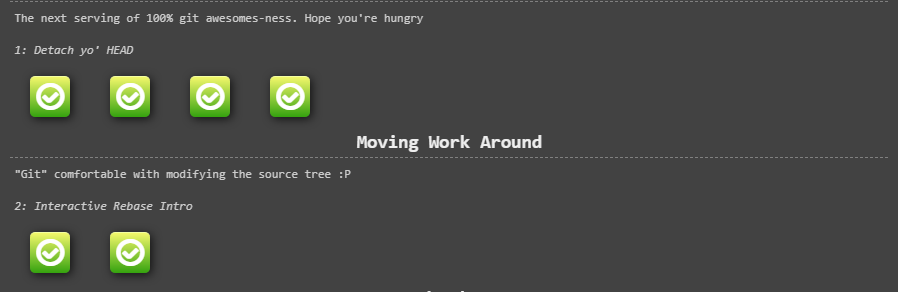
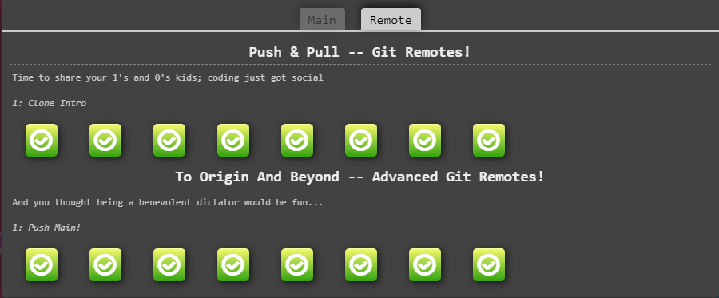
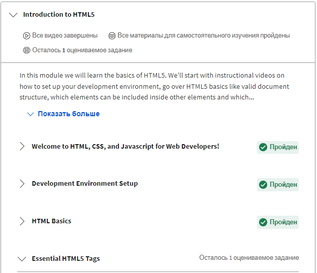
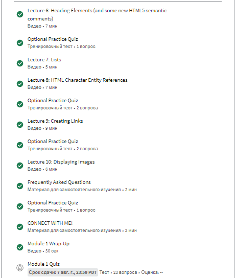
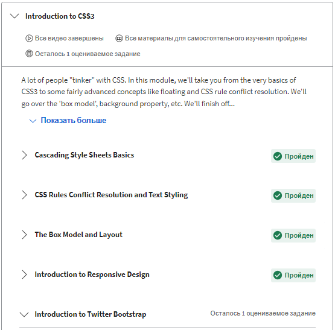
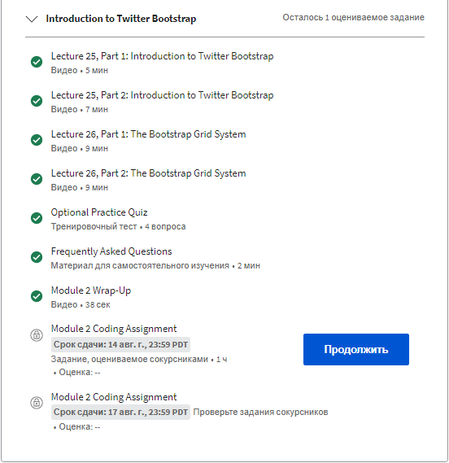
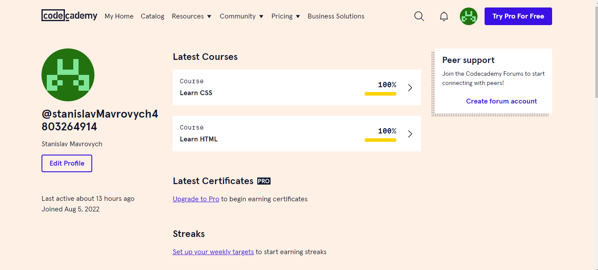

# Hello all!

___
## Git and GitHub

Screenshots

_This tutorial helped me to understand the branches more deeply. I did not know that there is such an interactive simulator for learning branches. After completing these lessons, I will return to them again!_

## Linux CLI, and HTTP

Screenshots

_For me, everything was new, since I had never come across a Linux system. At the first attempt to pass the tests, everything was not entirely clear, but on the second - everything began to fall into place. Apparently, this will be useful to me in the future, friends also say that it is necessary. I really liked the "kill" command._

## Git Collaboration

Screenshots

_While studying this material, I encountered certain difficulties associated with certain GIT commands, in the learning process I will return to them. It was interesting to study the analysis of conflicts. I think that this material will be useful in the work._

## Intro to HTML and CSS

Screenshots

_In this course, everything was clear, since I had already dealt with HTML and CSS. From the new I learned that the color can be indicated as a percentage (I will try to use this)._