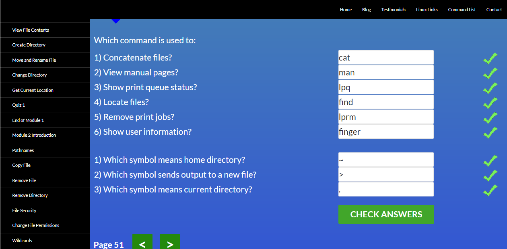

# Hello all!

___

## Git and GitHub

Screenshot

_This tutorial helped me to understand the branches more deeply. I did not know that there is such an interactive simulator for learning branches. After completing these lessons, I will return to them again!_

## Linux CLI, and HTTP

Screenshot

_For me, everything was new, since I had never come across a Linux system. At the first attempt to pass the tests, everything was not entirely clear, but on the second - everything began to fall into place. Apparently, this will be useful to me in the future, friends also say that it is necessary. I really liked the "kill" command._

